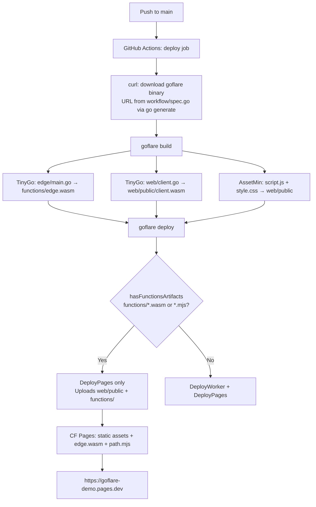

# CI/CD Flow — goflare-demo

## Flujo completo de deploy



## Fuente de verdad: `workflow/spec.go`

```
workflow/spec.go          ← EDITAR AQUÍ (versión, imagen, ProjectName)
    ↓ go generate ./workflow/
.github/workflows/deploy.yml  ← GENERADO (nunca editar a mano)
    ↓ misma spec importada
tests/ci_build_test.go    ← usa InstallScript() y DockerImage del spec
```

**El `go generate` se ejecuta automáticamente** cuando devflow actualiza la dependencia `goflare` en `go.mod` (paso 5.1 de `UpdateDependentModule`).

## Variables de entorno CI

| Variable | Tipo | Descripción |
|---|---|---|
| `CLOUDFLARE_API_TOKEN` | Secret | User API Token con permiso `Cloudflare Pages: Edit` |
| `CLOUDFLARE_ACCOUNT_ID` | Secret | ID de la cuenta Cloudflare (`b666...`) |
| `PROJECT_NAME` | Hardcoded en workflow | Nombre del proyecto Pages (de `workflow.ProjectName`) |

## TinyGo en CI (non-root)

`goflare build` llama `EnsureTinyGo()` → `tinygo.EnsureInstalled()`.  
En CI el runner es non-root → no puede escribir a `/usr/local`.  
`tinygo v0.0.11+` detecta esto y usa `$HOME/.local/tinygo` como fallback.

## Test local de CI (Docker)

```bash
go test -tags=integration -run TestCIBuild_Docker ./tests/ -v
```

Corre con `--user $(uid):$(gid)` — replica el entorno non-root de GitHub Actions.  
Si pasa localmente, el CI pasa.
